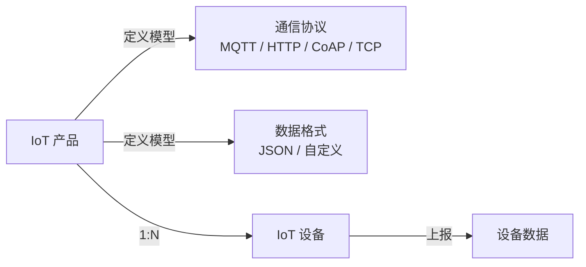

# 桔桔波管理系统（Orange-Wave-Management-System）

一个基于 **Spring Boot 3 + Vue 3** 的前后端分离后台管理系统框架，开箱即用，包含完整的用户认证、权限控制（RBAC）、菜单管理、操作日志、数据统计、文件上传、IoT 物联网管理、定时任务与代码生成等后台管理常用功能，可作为新项目快速起步的通用骨架。

---

##  开源说明

本项目采用 **MIT 开源协议** 进行开源。 ✅ 允许个人/企业免费使用、二次修改、商业用途、二次分发； ✅ 仅要求在衍生项目中保留原版权与 MIT 协议声明； ❌ 作者不承担软件使用带来的任何直接或间接风险。

完整协议内容请查看仓库根目录下的 `LICENSE` 文件。

## 在线体验

- 体验地址：**http://159.75.182.200/**
- 体验账号：`awei`
- 登录密码：`awei123456`

> 💡 本项目会**持续进行优化与部署更新**，线上地址与功能可能随时间迭代，建议以当前线上版本为最新体验。如遇访问异常或功能调整，欢迎反馈。

## 项目截图
### 登录页面

### 首页


## 一、项目概览

```
system/
├── springboot3-admin/        # 后端：Spring Boot 3 后台服务
│   ├── src/main/java/        # Java 源码
│   ├── src/main/resources/   # 配置文件、MyBatis Mapper XML
│   ├── target/               # 构建产物（含可执行 jar）
│   ├── pom.xml               # Maven 构建文件
│   └── build.log
├── vue3-admin/               # 前端：Vue 3 管理后台
│   ├── src/                  # 源码（views / layout / stores / utils / router）
│   │   └── views/dashboard/  # 可视化大屏（机房监控 / 全球航运 3D 地球）
│   ├── public/
│   ├── dist/                 # 构建产物（生产打包）
│   ├── index.html
│   ├── vite.config.js        # Vite 配置（含代理）
│   └── package.json
├── sql/
│   └── manager_system.sql    # 数据库建表与初始化脚本
└── README.md
```

| 模块 | 技术栈 | 端口 | 路径前缀 |
|------|--------|------|----------|
| 后端 | Spring Boot 3.1.12 / Java 17 | 8080 | `/api` |
| 前端 | Vue 3.5 + Vite 8 | 5173（dev） | `/` |

---

## 二、后端（springboot3-admin）

### 2.1 技术栈

| 类别 | 选型 |
|------|------|
| 基础框架 | Spring Boot 3.1.12（Java 17） |
| 持久层 | MyBatis-Plus 3.5.7（MySQL 8） |
| 安全框架 | Spring Security 6（无状态 / JWT） |
| 缓存 | Redis（spring-boot-starter-data-redis） |
| 工具 | Hutool 5.8.25、Lombok、Jackson（jsr310 时间支持）、MinIO Java SDK 8.5.17 |
| 鉴权令牌 | JJWT 0.11.5 |
| 接口文档 | Knife4j OpenAPI3（4.5.0，访问 `/doc.html`） |
| 其他 | spring-boot-starter-validation（参数校验）、spring-boot-starter-aop（操作日志切面） |

### 2.2 核心配置

- `application.yml`：全局配置，激活环境 `dev`（部署改为 `prod`），服务端口 `8080`，`context-path=/api`，文件上传上限 10MB/20MB，JWT 密钥与过期时间（默认 24h）。
- `application-dev.yml`：本地开发，MySQL `localhost:3306/manager_system`，Redis `127.0.0.1:6379`，开启 SQL 控制台日志。
- `application-prod.yml`：生产环境（服务器 `159.75.182.200`），通过 `forward-headers-strategy: native` 获取真实客户端 IP，关闭 SQL 日志；使用 MinIO 对象存储。
- 切换环境：`java -jar xxx.jar --spring.profiles.active=prod`

### 2.3 包结构（`com.admin`）

```
com.admin
├── AdminApplication.java          # 启动类（@MapperScan("com.admin.mapper")）
├── controller/                    # 接口层
│   ├── AuthController             # 登录 / 登出
│   ├── CaptchaController          # 图形验证码
│   ├── UserController             # 用户管理 + 个人信息 + 改密 / 重置密码
│   ├── RoleController             # 角色管理
│   ├── DeptController             # 部门管理
│   ├── DictController             # 字典管理（类型列表/分页 + 数据分页/批量删除）
│   ├── MenuController             # 菜单管理（树、用户菜单、用户权限、启停）
│   ├── NotifyMessageController    # 通知管理
│   ├── OperLogController          # 操作日志（含前端日志上报接口）
│   ├── StatisticsController       # 数据概览 / 趋势 / 最新用户
│   ├── FileController             # 文件上传
│   ├── HomeController             # 首页信息
│   ├── IotProductController       # IoT 产品管理
│   ├── IotDeviceController        # IoT 设备管理 + 设备数据查询
│   ├── GenController              # 代码生成
│   └── SysJobController           # 定时任务管理
├── entity/                        # 数据实体
│   ├── SysUser / SysRole / SysDept / SysMenu / SysDictType / SysDictData
│   ├── SysUserRole / SysRoleMenu  # 关联表
│   ├── SysNotifyMessage / SysOperLog
│   ├── IotProduct / IotDevice / IotDeviceData  # IoT 物联网
│   ├── GenTable                   # 代码生成表
│   └── SysJob / SysJobLog         # 定时任务
├── mapper/                        # MyBatis-Plus Mapper 接口
├── service/ + service/impl/       # 业务层
├── config/                        # 配置类
│   ├── SecurityConfig             # 安全链、CORS、密码编码器
│   ├── JwtAuthenticationFilter    # JWT 拦截器
│   ├── RedisConfig / MyBatisPlusConfig / JacksonConfig
│   ├── Knife4jConfig              # 接口文档
│   ├── DataInitializer            # 启动时自动修复数据关联
│   └── MyMetaObjectHandler        # 自动填充 createTime/updateTime
├── filter/                        # JwtAuthenticationFilter
├── dto/                           # LoginDTO、FrontendOperLogDto
└── common/
    ├── annotation/Log             # 操作日志注解
    ├── enums/                     # BusinessType、OperatorType
    ├── security/                  # LoginUser、UserDetailsServiceImpl
    ├── result/                    # Result<T>、ResultCodeEnum（统一响应）
    ├── exception/                 # 全局异常处理器、ServiceException
    └── util/                      # JwtUtil、RedisUtil、IpUtil、CaptchaUtil、SecurityUtil
```

### 2.4 关键功能实现

- **多方式登录**：支持**密码登录**、**邮箱验证码登录**、**手机号验证码登录**三种方式。邮箱验证码通过 QQ 邮箱 SMTP 发送（免费），手机验证码需接入腾讯云短信（详见「六、多方式登录」章节）。
- **认证流程**：密码登录（`/auth/login`）先校验 Redis 中的图形验证码（一次性），再经 Spring Security `AuthenticationManager` 校验账号密码（BCrypt 加密）通过后生成 JWT 并返回，同时把 `LoginUser` 缓存到 Redis（`login:user:{userId}`，与 JWT 同过期）。验证码登录（`/auth/login/code`）先校验 Redis 中的短信/邮箱验证码（一次性，5 分钟有效），再查找用户构建登录态；**若账号不存在则自动注册**（手机号注册 → 昵称"手机号用户"、账号为手机号；邮箱注册 → 昵称"邮箱用户"、账号为邮箱 @ 前部分），默认角色为普通用户，默认密码 `123456`。
- **无状态鉴权**：`SecurityConfig` 关闭 session（`STATELESS`），所有受保护接口需携带 `Authorization: Bearer <token>`；`JwtAuthenticationFilter` 解析 token 并重建 `Authentication`。
- **权限控制**：基于 RBAC，使用 `@PreAuthorize("hasAuthority('xxx')")` 进行方法级鉴权；菜单 `perms` 字段即权限标识；前端根据 `/system/menu/user-permissions` 接口获取完整权限列表（含按钮级），通过自定义指令 `v-has-perm` 控制按钮显隐。
- **操作日志**：通过 `@Log` 注解 + AOP（`LogAspect`）自动记录后端增删改查；前端页面访问与接口失败也会调用 `OperLogController` 的 frontend 上报接口，统一落入 `sys_oper_log`。
- **动态菜单 / 路由**：菜单表以树形结构维护（`type`：0 目录 / 1 菜单 / 2 按钮），前端 `utils/dynamicRouter.js` 将 `user-menu` 转为 Vue Router 路由。
- **数据自修复**：`DataInitializer` 在应用启动时检查并补全 admin 用户角色、IoT 物联网模块、代码生成模块、定时任务模块、通知/用户/操作日志的按钮权限与「系统监控」目录，确保功能开箱可用（仅修复、不覆盖已有数据）。
- **时区自动适配**：`AdminApplication` 启动时强制设置 JVM 默认时区为 `Asia/Shanghai`，确保 Docker / 1Panel 容器部署时 `LocalDateTime.now()` 返回北京时间（避免操作日志慢 8 小时问题）。

### 2.5 主要接口一览（`/api` 前缀）

| 模块 | 接口 | 说明 |
|------|------|------|
| 认证 | `POST /auth/login`、`POST /auth/login/code`、`POST /auth/send-code`、`POST /auth/logout`、`GET /auth/captcha` | 密码登录、验证码登录、发送验证码、登出、图形验证码 |
| 用户 | `/system/user/page`、`/system/user/{id}`、`POST /system/user`、`PUT /system/user`、`DELETE /system/user/{id}`、`/system/user/profile`、`/system/user/reset-password/{id}`、`GET /system/user/export` | 分页、详情、增改删、个人信息、重置密码、导出全量数据 |
| 字典 | `/system/dict/type/list`、`/system/dict/type/page`、`POST/PUT/DELETE /system/dict/type`、`/system/dict/data/list`、`/system/dict/data/page`、`POST/PUT/DELETE /system/dict/data`、`DELETE /system/dict/data/batch` | 左侧类型列表（搜索）、类型分页与增改删、字典数据全量（缓存用）、数据分页与增改删、批量删除 |
| 角色 | `/system/role/...` | 角色增删改查与权限分配 |
| 部门 | `/system/dept/...` | 部门树 |
| 菜单 | `/system/menu/tree`、`/system/menu/user-menu`、`/system/menu/user-permissions`、`POST/PUT/DELETE`、`/system/menu/toggle-status` | 菜单树、用户菜单、用户权限列表（含按钮级权限标识）、启停 |
| 通知 | `/system/notify/...` | 通知管理 |
| 操作日志 | `/monitor/operlog/...`、`POST /monitor/operlog/frontend` | 查询/删除/清空、前端日志上报 |
| 定时任务 | `/monitor/job/page`、`/monitor/job/{id}`、`POST/PUT/DELETE`、`/monitor/job/log/page` | 任务增删改查、调度日志分页 |
| IoT 物联网 | `/iot/product/page`、`/iot/product/list`、`/iot/product/{id}`、`POST/PUT/DELETE`、`/iot/device/page`、`/iot/device/{id}`、`/iot/device/{id}/data`、`POST/PUT/DELETE` | 产品与设备管理、设备最新数据查询 |
| 代码生成 | `/tool/gen/page`、`/tool/gen/{id}`、`POST /tool/gen/code/{id}` | 代码生成表分页、详情、生成代码 |
| 统计 | `/statistics/overview`、`/statistics/user-trend`、`/statistics/user-trend-week`、`/statistics/latest-users` | 概览、月/周趋势、最新用户 |
| 文件 | `POST /common/upload`、`GET /uploads/{文件名}` | 文件上传及文件流式访问（生产环境由 MinIO 保存） |

> 接口文档（Knife4j）：启动后访问 `http://localhost:8080/api/doc.html`

---

## 三、前端（vue3-admin）

### 3.1 技术栈

| 类别 | 选型 |
|------|------|
| 框架 | Vue 3.5（`<script setup>`） |
| 构建 | Vite 8 |
| UI | Element Plus 2.14 + @element-plus/icons-vue |
| 状态管理 | Pinia 3（user / menu / tagsView / theme） |
| 路由 | Vue Router 4（动态路由 + 权限守卫） |
| 请求 | Axios（统一拦截、Token 注入、错误上报） |
| 图表 | ECharts 6 + vue-echarts 8 |
| 3D 可视化 | Three.js 0.185（3D 地球 / 星空 / 航线） |
| 其他 | NProgress（路由进度条）、中文语言包、xlsx（Excel 导出）、jspdf + html2canvas（PDF 导出）、docx（Word 导出）、jszip（ZIP 打包） |

### 3.2 目录结构（`src`）

```
src/
├── main.js                 # 入口：挂载 Pinia、Router、ElementPlus、全局图标、主题初始化、注册 v-has-perm 指令
├── App.vue
├── style.css               # 全局样式
├── router/index.js         # 静态路由 + 动态路由加载 + 路由守卫（鉴权、进度条、日志上报）
├── layout/                 # 整体布局
│   ├── index.vue           # Layout 根（含侧边栏 / 顶栏 / 标签栏 / 内容区）
│   └── components/
│       ├── Sidebar.vue / HorizontalSidebar.vue / TopMenu.vue / MenuItem.vue  # 菜单
│       ├── Navbar.vue      # 顶栏（用户、主题、退出）
│       ├── TagsView.vue    # 多标签标签页
│       ├── SettingDrawer.vue / SettingFloatButton.vue  # 主题设置
├── components/
│   └── ExportDropdown.vue  # 通用导出下拉按钮（支持 Excel/PDF/Word/ZIP）
├── views/                  # 页面
│   ├── login/index.vue     # 登录（账号 + 验证码）
│   ├── home/               # 首页
│   ├── statistics/index.vue# 数据概览仪表盘（卡片 + ECharts 图表）
│   ├── dashboard/          # 可视化大屏
│   │   ├── index.vue       # 机房监控大屏（实时指标 / ECharts 图表）
│   │   └── shipping.vue    # 全球航运大屏（Three.js 3D 地球 / 航线 / 地图纹理）
│   ├── monitor/
│   │   ├── operlog/        # 操作日志查看
│   │   └── job/            # 定时任务 + 调度日志
│   ├── iot/
│   │   ├── product/        # IoT 产品管理
│   │   └── device/         # IoT 设备管理
│   ├── tool/
│   │   └── gen/            # 代码生成
│   ├── system/
│   │   ├── user/           # 用户管理
│   │   ├── role/           # 角色管理
│   │   ├── dept/           # 部门管理
│   │   ├── menu/           # 菜单管理
│   │   ├── dict/           # 字典管理（类型 + 数据联动，支持后端搜索）
│   │   └── notify/         # 通知管理
│   └── redirect.vue        # 重定向 / 404 兜底
├── stores/                 # Pinia：user（Token/信息）、menu（动态菜单/权限列表）、tagsView、theme
├── utils/
│   ├── request.js          # Axios 实例 + 拦截器（Token、401 跳登录、403 提示、失败日志上报）
│   ├── dynamicRouter.js    # 后端菜单 → 前端路由
│   ├── operlog.js          # 操作日志上报封装
│   ├── export.js           # 通用导出工具（Excel/PDF/Word/ZIP）
│   ├── icons.js / date.js  # 图标映射、日期工具
└── styles/                 # variables.css / global.css
```

### 3.3 主要特性

- **动态路由 + 按钮级权限**：登录后拉取「用户菜单」与「用户权限」，前端生成动态路由；页面内按钮通过自定义指令 `v-has-perm` 控制显隐，权限标识由 `/system/menu/user-permissions` 接口统一返回（含目录、菜单、按钮三级）。
- **登录鉴权守卫**：未登录跳转 `/login?redirect=...`；刷新后自动重拉用户信息并重新注册动态路由；根路径 `/` 固定重定向到 `/home`。
- **多标签导航（TagsView）**：支持页签打开/关闭/刷新，刷新后状态保留。
- **主题切换**：明亮 / 暗黑主题，设置通过 `theme` store 持久化（挂载前初始化避免闪烁）。
- **操作日志联动**：页面访问与接口失败自动上报到后端 `sys_oper_log`，可在「系统监控 → 操作日志」查看。
- **数据可视化**：统计页使用 ECharts 展示用户注册月/周趋势、概览卡片与最新用户列表；可视化大屏模块（机房监控大屏 + 全球航运大屏）提供沉浸式全屏数据监控，全球航运大屏基于 Three.js 实现 3D 地球（含高清纹理、夜间灯光、云层、大气光晕），支持航线飞线动画、点击下钻与 CSS2D 地名标注。详见 [四、可视化大屏](#四可视化大屏)。
- **数据导出**：通过可复用的 `ExportDropdown` 组件，支持将任意列表数据导出为 **Excel (.xlsx)**、**PDF (.pdf)**、**Word (.docx)** 或 **ZIP 打包下载**（含以上三种格式）。PDF 基于 html2canvas 将 HTML 表格渲染为图片，完美支持中文；Word 基于 docx 库生成带格式的表格文档。用户管理页已集成，其他页面只需传入列定义与数据即可复用，详见 `src/utils/export.js`。导出时自动携带搜索条件、数据自动脱敏（如密码字段）。
- **字典管理**：维护系统字典类型（如用户性别、系统开关、通知类型等）及对应数据项；类型与数据两级联动，点击类型行即可查看和管理其下的字典键值，支持新增/编辑/删除/搜索、排序、默认值与状态控制。

### 3.4 开发 / 构建

```bash
cd vue3-admin
npm install
npm run dev        # 开发服务器 http://localhost:5173，代理 /api → 后端 8080
npm run build      # 生产打包到 dist/
npm run preview    # 预览构建产物
```

`vite.config.js` 关键配置：开发端口 `5173`；`/api` 与 `/uploads` 代理到 `http://localhost:8080`（可用 `VITE_PROXY_TARGET` 覆盖）；`build` 阶段按依赖（echarts / element-plus / vue-vendor）分包，提升缓存命中率。

---

## 四、可视化大屏

可视化大屏模块提供两套不同场景的沉浸式全屏数据监控页面，均采用深色科技风设计，支持全屏展示与响应式布局。

### 4.1 智慧机房可视化监控大屏

基于 Three.js 构建 3D 设备机房场景，以等距视角呈现设备布局，配合 ECharts 图表实现全方位数据监控。

**页面布局**（三栏式）：
- **顶部标题栏**：大屏标题、在线/告警/离线设备实时指示、当前时间、全屏按钮
- **左侧面板**：设备在线趋势（折线图）、区域设备分布（饼图）
- **中间区域**：核心指标卡片（设备总数/在线率/平均负载/总功耗）、3D 设备场景（Three.js）、状态图例
- **右侧面板**：设备能耗排行（柱状图）、实时告警列表

**3D 场景特性**：
- 12 台设备以方块形式分布在场景中，颜色反映状态（绿色正常/黄色告警/红色故障）
- 设备模型含主体方块、底部底座、顶部状态指示灯
- 中心发光环 + 浮动粒子效果增强科技感
- 鼠标悬浮设备显示详细信息（设备ID、状态、CPU负载、内存、温度）
- 相机支持旋转/缩放（OrbitControls），设备指示灯脉动闪烁
- 地面网格、阴影与场景雾效营造机房氛围

**文件位置**：`src/views/dashboard/index.vue`

### 4.2 全球航运可视化保障大屏

基于 Three.js 实现完整的 3D 地球场景，包含高清纹理、航线飞线动画、城市标注与点击下钻，是系统中最复杂的可视化页面。

**页面布局**（三栏式）：
- **顶部标题栏**：大屏标题、实时时钟、全屏按钮
- **左侧面板**：实时航运动态（4 指标卡片：今日航班/在途船舶/到港班次/延误预警）、航线运行趋势（ECharts 折线图）、热门航线 TOP5（含排名、航线名、班次、准点率表格）
- **中间区域**：3D 地球场景（含悬浮提示与下钻面板）、底部 5 项核心统计（货运吞吐量/运行状况/天气影响/燃油消耗/告警概览）
- **右侧面板**：航线覆盖分布（环状饼图）、运行态势分析（4 个仪表盘：准点率/满载率/运行率/安全率）、实时告警列表

**3D 地球核心特性**：
- 高清地球纹理（支持多源降级加载）、凹凸贴图、夜间灯光层（程序化点阵兜底）
- 云层纹理（支持缺失降级）、大气层光晕（双层 BackSide 球体）、经纬线网格、星空背景
- **50+ 全球港口城市**按大洲分层标记（亚洲/欧洲/北美/南美/非洲/大洋洲），含起止柱标记 + 发光球体 + CSS2D 名称标签
- **120+ 条航线**以贝塞尔曲线飞线连接，每条线含 3 个流动粒子脉动动画
- **天地图风格地名标注**：大洲名称、四大洋、主要海域、国家/地区、重要海峡运河（马六甲/苏伊士/巴拿马）、中国与世界主要城市
- **悬浮交互**：鼠标悬浮城市显示经纬度、类型、所属区域、进出港数据、准点率；非城市位置自动匹配最近城市
- **点击下钻**：点击城市触发相机平滑推进动画（easeInOutCubic），弹出详情面板（所属大洲/国家/港口类型/年吞吐量/准点率/在港船舶/周边港口/主要航线），再次点击或关闭返回全局
- **自转控制**：地球自动旋转（可暂停/恢复）
- 夜间灯光纹理加载失败时自动降级为程序化 Canvas 点阵（覆盖 50+ 城市坐标）

**技术要点**：
- Three.js + OrbitControls + CSS2DRenderer（地名标签）
- Raycaster 射线检测实现精确的城市悬浮/点击交互
- 相机平滑过渡动画（下钻推进/返回全局，easeInOutCubic 缓动）
- Canvas 程序化生成夜间灯光（CanvasTexture）
- 飞线粒子使用 QuadraticBezierCurve3 路径计算，每条线 3 个脉动粒子
- ECharts 仪表盘/折线/饼图与 Three.js 场景共享显存

**文件位置**：`src/views/dashboard/shipping.vue`

### 4.3 大屏通用设计

- **全屏支持**：两页面均支持浏览器全屏 API（`requestFullscreen`），适配 F11 全屏体验
- **深色科技风**：统一采用深蓝暗色背景 + 半透明面板 + 毛玻璃效果（`backdrop-filter`）+ 边框渐变发光
- **响应式适配**：支持 1200px / 1600px 多断点布局切换，小屏下三栏变为纵向排列
- **实时时钟**：每秒更新，Consolas 等宽字体显示，带发光文字阴影
- **独立样式作用域**：使用 `scoped` + 全局非 scoped 样式混用，3D 标签样式通过单独 `<style>` 块定义

---

## 五、IoT 物联网

### 5.1 概述

IoT 物联网模块提供完整的产品管理与设备管理能力，支持多种协议与数据格式，可快速接入各类物联网设备。



- **产品（IotProduct）**：定义一类设备的公共模型，包括设备类型、通信协议、数据格式等。
- **设备（IotDevice）**：产品下的具体实例，拥有唯一设备标识和认证密钥。
- **设备数据（IotDeviceData）**：设备上报的最新属性值（按属性名存储，同一设备同属性覆盖式更新）。

### 5.2 数据库表

| 表名 | 说明 | 关键字段 |
|------|------|----------|
| `iot_product` | 产品表 | `product_name`, `product_key`, `device_type`(sensor/actuator/gateway), `protocol_type`(mqtt/http/coap/tcp), `data_format`(json/custom), `status`(1启用/0禁用) |
| `iot_device` | 设备表 | `device_name`, `device_key`(唯一标识), `device_secret`(认证密钥), `product_id`(所属产品), `status`(0未激活/1在线/2离线) |
| `iot_device_data` | 设备数据表 | `device_id`, `property_name`(属性名), `property_value`(属性值), `report_time`(上报时间) |

### 5.3 后端接口（`/api/iot`）

**产品管理**：

| 方法 | 接口 | 说明 |
|------|------|------|
| GET | `/product/page` | 分页查询产品（`productName`, `productKey`, `status`） |
| GET | `/product/list` | 全部产品列表（供设备关联选择） |
| GET | `/product/{id}` | 产品详情 |
| POST | `/product` | 新增产品 |
| PUT | `/product` | 编辑产品 |
| DELETE | `/product/{id}` | 删除产品 |

**设备管理**：

| 方法 | 接口 | 说明 |
|------|------|------|
| GET | `/device/page` | 分页查询设备（`deviceName`, `productId`, `status`） |
| GET | `/device/{id}` | 设备详情 |
| GET | `/device/{id}/data` | 设备最新上报数据 |
| POST | `/device` | 注册设备（含密钥） |
| PUT | `/device` | 编辑设备 |
| DELETE | `/device/{id}` | 删除设备 |

### 5.4 前端页面

| 页面路径 | 文件位置 | 说明 |
|----------|----------|------|
| IoT 产品管理 | `src/views/iot/product/index.vue` | 卡片式布局，支持产品名称/标识/状态筛选，产品增删改查 |
| IoT 设备管理 | `src/views/iot/device/index.vue` | 卡片式布局，支持设备名称/所属产品/状态筛选，设备注册/编辑/删除，查看设备最新数据 |

两页面均采用网格卡片式布局，每个卡片左侧展示核心信息（设备类型、通信协议、数据格式、产品/设备标识），右侧展示产品默认图。

### 5.5 数据初始化

`DataInitializer` 会在应用启动时自动补全 IoT 相关菜单和按钮权限：

- **目录**：物联网（`/iot`）
- **菜单**：产品管理（`/iot/product`）、设备管理（`/iot/device`）
- **权限标识**：`iot:product:add/edit/remove`、`iot:device:add/edit/remove`

无需手动插入菜单数据，开箱即用。

---

## 六、多方式登录

本项目支持三种登录方式，用户可在登录页自由切换：

| 登录方式 | 适用范围 | 费用 | 配置难度 |
|----------|----------|------|----------|
| 密码登录 | 所有用户 | 免费 | 无需配置 |
| 邮箱验证码登录 | 所有用户（账号不存在自动注册） | 免费（QQ 邮箱 SMTP） | 简单，配好 SMTP 授权码即可 |
| 手机号验证码登录 | 所有用户（账号不存在自动注册） | 约 0.045 元/条 | 需开通腾讯云短信服务 |

### 6.1 邮箱验证码登录（✅ 可直接使用）

用户输入已绑定的邮箱地址，点击「发送验证码」，系统通过 QQ 邮箱 SMTP 向该邮箱发送 6 位数字验证码，有效期 5 分钟，同一邮箱 60 秒内只能发送一次。

**开通步骤：**

1. 登录 QQ 邮箱 → 设置 → 账户 → 开启 **SMTP 服务**
2. 按提示发送短信验证后，获得 **16 位 SMTP 授权码**
3. 在 `application-{env}.yml` 中配置：

```yaml
spring:
  mail:
    host: smtp.qq.com
    port: 587
    username: 你的QQ邮箱@qq.com     # 发件邮箱
    password: 你的16位SMTP授权码      # 不是 QQ 密码
    properties:
      mail:
        smtp:
          auth: true
          starttls:
            enable: true
            required: true
```

> 未配置邮件服务时，验证码会自动降级为**控制台日志打印**（关键词 `邮箱验证码`），系统不会报错或崩溃。

**使用前提：**

- 邮箱验证码登录无需提前创建账号，输入已配置 SMTP 的邮箱即可
- 若账号不存在，系统自动注册：昵称默认为「邮箱用户」，账号为邮箱 @ 前部分（如 `test@163.com` → 账号 `test`），默认角色为普通用户，默认密码 `123456`
- 已有账号且状态正常时，直接登录

**发送逻辑：**

- 验证码存入 Redis，Key 为 `code:email:{邮箱}`，5 分钟有效
- 同一邮箱 60 秒内只能发一次，防刷
- 验证码校验后立即删除（一次性使用）
- 单个 QQ 邮箱每日约 100 封上限，内部管理系统足够

### 6.2 手机号验证码登录（⚠️ 需接入短信平台）

手机验证码登录代码已完整实现，但目前**尚未接入真实短信服务**，需按以下步骤接入后方可使用。

**当前默认行为：**

未配置短信参数时，验证码会**降级为控制台日志打印**（关键词 `短信验证码`），不影响系统正常使用，但用户收不到真实短信。

**接入腾讯云短信步骤：**

1. 登录 [腾讯云短信控制台](https://console.cloud.tencent.com/smsv2)
2. 创建应用 → 获取 **SDK AppId**
3. 申请**签名**（如：桔桔波）→ 获取签名名称
4. 申请**正文模板**，内容示例：`您的验证码为{1}，5分钟有效，请勿泄露。` → 获取**模板 ID**
5. [API 密钥管理](https://console.cloud.tencent.com/cam/capi) → 获取 **SecretId** 和 **SecretKey**
6. 在 `application-{env}.yml` 中配置：

```yaml
sms:
  tencent:
    secret-id: AKIDxxxx              # SecretId
    secret-key: xxxxxx               # SecretKey
    sdk-app-id: "1400xxxxxx"         # SDK AppId
    sign-name: 桔桔波                # 短信签名名称
    template-id: "2345678"           # 短信模板 ID
```

> 配置完成后重新构建部署即可生效。新用户有 **100 条免费测试额度**。

**短信发送逻辑（与邮箱一致）：**

- 验证码存入 Redis，Key 为 `code:sms:{手机号}`，5 分钟有效
- 同一手机号 60 秒内只能发一次
- 验证码校验后立即删除（一次性使用）
- 国内手机号自动添加 `+86` 前缀

**使用前提：**

- 手机号验证码登录无需提前创建账号，配置好短信服务后即可使用
- 若账号不存在，系统自动注册：昵称默认为「手机号用户」，账号为手机号本身，默认角色为普通用户，默认密码 `123456`
- 已有账号且状态正常时，直接登录
- 需配置腾讯云短信四项参数

> 如希望使用其他短信服务商（阿里云等），可自行替换 `VerificationCodeServiceImpl.sendSms()` 方法中的实现，接口定义保持不变。

---

## 七、运行与部署

### 7.1 环境依赖

- JDK 17+
- Maven 3.8+
- MySQL 8（数据库名 `manager_system`）
- Redis 6+
- Node.js 18+（前端）
- MinIO RELEASE.2025-04-22T22-12-26Z（统一对象存储）

### 7.2 数据库初始化

> 项目根目录 `sql/manager_system.sql` 包含完整的建表与初始化数据脚本（含菜单、角色、权限等）。导入方式：
>
> ```bash
> # 创建数据库后导入（按提示替换用户名密码）
> mysql -u root -p manager_system < sql/manager_system.sql
> ```
>
> 表结构要点：
> - 表名统一为 `sys_*`；
> - 主键 `id` 为 `BIGINT AUTO_INCREMENT`；
> - `create_time` / `update_time` 由 `MyMetaObjectHandler` 自动填充；
> - `sys_menu` 含 `parent_id / menu_name / path / component / perms / type(0目录 1菜单 2按钮) / icon / sort / visible / always_show / status` 等字段。
> 应用启动后 `DataInitializer` 会自动补全 admin 角色与菜单关联，无需手工处理。
>
> 若已有数据库，可执行增量脚本添加字典模块：
> ```bash
> mysql -u root -p manager_system < sql/update_dict.sql
> ```
> 增量脚本包含：`sys_dict_type`（字典类型表）、`sys_dict_data`（字典数据表）、字典管理菜单与按钮权限（`system:dict:list/add/edit/remove`），以及三条内置字典（用户性别、系统开关、通知类型）。

### 7.3 启动步骤

1. 启动 MySQL、Redis。
2. 后端：
   ```bash
   cd springboot3-admin
   mvn spring-boot:run        # 或 mvn package 后 java -jar target/springboot3-admin-1.0.0.jar
   ```
   接口地址：`http://localhost:8080/api`，文档：`http://localhost:8080/api/doc.html`
3. 前端：
   ```bash
   cd vue3-admin
   npm install && npm run dev
   ```
   浏览器打开 `http://localhost:5173`。
4. 生产部署：前端 `npm run build` 后将 `dist/` 由 Nginx 托管（反向代理 `/api` 到后端 8080），后端以 `prod` 环境运行。

#### Docker / 1Panel 部署注意

- **时区问题**：容器默认时区为 UTC，代码已通过 `AdminApplication` 启动时强制设置 `TimeZone.setDefault("Asia/Shanghai")`，同时建议在 1Panel 容器环境变量中添加 `TZ=Asia/Shanghai`，双重保障操作日志时间正确。

#### MinIO 对象存储

- `compose.yml` 已固定使用 `minio/minio:RELEASE.2025-04-22T22-12-26Z`，后端通过内部地址 `http://minio:9000` 访问；MinIO API 不映射到宿主机，控制台通过宿主机 `9001` 端口访问。
- 启动 Compose 前需要配置 `MYSQL_PASSWORD`、`REDIS_PASSWORD`、`MINIO_ROOT_USER`、`MINIO_ROOT_PASSWORD` 四个环境变量，其中 MinIO 密码至少 8 位；可选配置 `MINIO_BUCKET`，默认桶名为 `jujubo-system`。
- 生产环境执行 `docker compose up -d --build` 后，上传接口仍为 `POST /api/common/upload`，文件访问地址仍为 `/uploads/{文件名}`，浏览器不会接触 MinIO 密钥。
- 开发和生产环境均使用 MinIO，请按 `MINIO_ENDPOINT`、`MINIO_ACCESS_KEY`、`MINIO_SECRET_KEY`、`MINIO_BUCKET` 配置连接信息。
- 公网管理地址为 `http://服务器IP:9001`，部署时还需在云安全组和服务器防火墙中放行 TCP `9001`。

### 7.4 IP 归属地解析

操作日志的「IP 归属地」(`operLocation`) 支持**自动降级**的三级策略：

| 优先级 | 方案 | 依赖 | 说明 |
|--------|------|------|------|
| 1 | ip2region 离线库 | 把 `ip2region.xdb` 放到 jar 同目录 | 快、无网络，可选 |
| 2 | ip-api.com 在线 API | **零依赖**，无需任何文件 | 免费，有内存缓存（同 IP 每小时只查一次） |
| 3 | 降级兜底 | 无 | 以上都不可用时返回「未知」 |

> 代码位于 `IpUtil.getRealAddressByIp()`。**什么都不做也能用**，系统会自动走在线 API。如果追求更快/更稳，才放 xdb 文件启用离线库。

**可选：启用离线库加速**
```bash
# 在服务器上 jar 同目录下载 xdb 文件（约 10MB+）
cd /home/backend  # 你的 jar 所在目录
curl -L -o ip2region.xdb https://raw.githubusercontent.com/lionsoul2014/ip2region/master/data/ip2region_v4.xdb
# 校验大小应 > 1MB
ls -lh ip2region.xdb
```
若 GitHub 受限可用 Gitee：`https://gitee.com/lionsoul/ip2region/raw/master/data/ip2region_v4.xdb`

---

## 八、默认账号与自动注册说明

- **超级管理员**：`id=1`，关联角色 `role_id=1`（超级管理员）。管理员可在「用户管理」中将用户密码重置为默认 `awei123456`。
- **自动注册**：使用手机号/邮箱验证码登录时，若账号不存在则自动注册。自动注册用户默认参数如下：

| 属性 | 手机号注册 | 邮箱注册 |
|------|-----------|----------|
| 昵称 | 手机号用户 | 邮箱用户 |
| 账号 | 手机号（如 `13800138000`） | 邮箱 @ 前部分（如 `test@163.com` → `test`） |
| 密码 | `123456`（BCrypt 加密） | `123456`（BCrypt 加密） |
| 角色 | 普通用户（`role_id=2`） | 普通用户（`role_id=2`） |

- 登录需输入图形验证码（由 `/auth/captcha` 生成，存入 Redis，一次性使用）。

---
